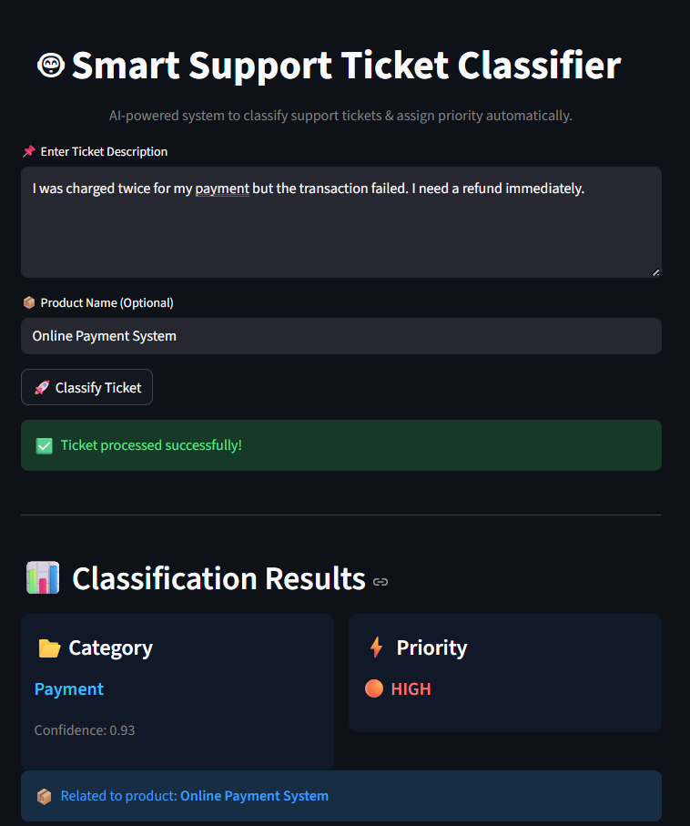

# 🧾 Smart Support Ticket Classifier

An AI-powered web application that automatically classifies customer support tickets and assigns priority levels using Machine Learning and Natural Language Processing (NLP).

---

## 🚀 Project Overview

Handling customer support tickets manually can be time-consuming and inefficient.  
This project automates the process by analyzing ticket descriptions and predicting:

- 📂 Ticket Category (Refund, Payment, Technical, Support)
- ⚡ Priority Level (Critical, High, Medium, Low)

---

## 🎯 Features

- ✅ NLP-based text classification  
- ✅ Automatic priority assignment  
- ✅ Confidence score for predictions  
- ✅ Interactive web app using Streamlit  
- ✅ Clean and modern UI  
- ✅ Real-time ticket analysis  

---

## 🛠️ Technologies Used

- Python 🐍  
- Pandas  
- Scikit-learn  
- Streamlit  
- CountVectorizer (NLP)  

---

## 🧠 Machine Learning Approach

- Text data is preprocessed (lowercasing, removing noise)  
- Converted into numerical format using **CountVectorizer**  
- A **Multinomial Naive Bayes** model is trained  
- Model predicts category and assigns priority  

---

## 📊 Project Demo

### 🔹 Input  
User enters a support ticket description  

### 🔹 Output  
- Ticket Category  
- Assigned Priority  
- Prediction Confidence  

---

## 📸 Screenshots

### 🖥️ App Interface  


---

## ⚙️ How to Run

```bash
pip install streamlit pandas scikit-learn
streamlit run Support_Ticket.py
